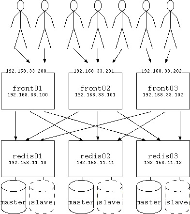

# Blendle Developer Operations Assignment #
Entry by Mathijs M&ouml;hlmann.

I've had a lot of fun doing this assignment. I took the opportunity to play around with redis cluster. This is a very new feature of redis (since 3.0) so I would not recommend using this in production yet. It gave me all kinds of trouble, but made it run in the end.

## The setup ##

I've deployed the lamernews application onto six virtual machines. These are created via `vagrant`. I'm using ubuntu 14.04 with `virtualbox` on my development machine, but since I don't know what you are using I'm directing you to [the vigrant download page](http://www.vagrantup.com/downloads) for installation instruction for your platform. I'm using version 1.7.2. Note that it should also be possible to use `vagrant` with any other virtualization tool, but I haven't tested that for this setup.



## Using the code ##

First step is to download this archive and fetch all its dependencies. These instructions assume you use some kind of UNIX shell, but can be easily translated to other platforms.

```bash
mkdir entry_mathijs; cd entry_mathijs
git clone https://github.com/secmff/my_entry.git
cd my_entry
git submodule update --init
```
Now you should be able to install the environment (make sure you have some RAM):
```bash
vagrant up
```
This will provision all the servers. Note that some warnings within modules I'm using still remain, but these are non-fatal. All redis servers need to be bootstrapped before we can setup the cluster. We will do that by hand afterwards:
```bash
vagrant ssh redis01 --command /vagrant/setup_cluster.sh
```
Note that stock redis cluster create script doesn't always do the right thing when setting up the cluster. The master and slaves are sometimes on the same host. So `setup_cluster.sh` works around that.
Create the following entry in your `/etc/hosts` or equivalent:
```
192.168.33.200  news.blendle.com
192.168.33.201  news.blendle.com
192.168.33.202  news.blendle.com
```
You can choose an other hostname if this one intervenes with your setup. You should now be able to access the application by pointing your browser at: http://news.blendle.com. Normal deployment would use a round-robin DNS entry. Of course you could simply use the IP addresses as well.

To gain access to these machines use:
```bash
vagrant ssh redis01
vagrant ssh front01
etc...
```

## redis cluster ##
On every `redis` machine there are two instances of redis running. One is the master of a subset of all the keys in the redis-database. The other on is a slave of some other master.
```bash
vagrant ssh redis01 --command '/opt/redis-src/src/redis-trib.rb check 192.168.33.10:6379'
```
```
Connecting to node 192.168.33.10:6379: OK
Connecting to node 192.168.33.11:6380: OK
Connecting to node 192.168.33.12:6379: OK
Connecting to node 192.168.33.10:6380: OK
Connecting to node 192.168.33.12:6380: OK
Connecting to node 192.168.33.11:6379: OK
>>> Performing Cluster Check (using node 192.168.33.10:6379)
M: db58de944103c83fa05f521b2ff5c2699093946c 192.168.33.10:6379
   slots:0-5460 (5461 slots) master
   1 additional replica(s)
S: 424404955b91c599ee96031522297e63c2ba0915 192.168.33.11:6380
   slots: (0 slots) slave
   replicates db58de944103c83fa05f521b2ff5c2699093946c
M: 489155e4ac66f9bb40ce78bdfcc494041feb2400 192.168.33.12:6379
   slots:10923-16383 (5461 slots) master
   1 additional replica(s)
S: 7a92ce30c38e8beefa574bffc3fcd0e28fb1bca0 192.168.33.10:6380
   slots: (0 slots) slave
   replicates 489155e4ac66f9bb40ce78bdfcc494041feb2400
S: ccb1b64cc0be8cdc0615ad961f3a1db0eaf4fee0 192.168.33.12:6380
   slots: (0 slots) slave
   replicates bd1f6e7066769d2f60dc34cd457c12769bd97838
M: bd1f6e7066769d2f60dc34cd457c12769bd97838 192.168.33.11:6379
   slots:5461-10922 (5462 slots) master
   1 additional replica(s)
[OK] All nodes agree about slots configuration.
>>> Check for open slots...
>>> Check slots coverage...
[OK] All 16384 slots covered.
```
Now for the fun part: completely destroy one of the cluster nodes:
```bash
vagrant destroy redis02
vagrant ssh redis01 --command '/opt/redis-src/src/redis-trib.rb fix 192.168.33.10:6379'
```
```
Connecting to node 192.168.33.10:6379: OK
Connecting to node 192.168.33.12:6379: OK
Connecting to node 192.168.33.10:6380: OK
Connecting to node 192.168.33.12:6380: OK
>>> Performing Cluster Check (using node 192.168.33.10:6379)
M: db58de944103c83fa05f521b2ff5c2699093946c 192.168.33.10:6379
   slots:0-5460 (5461 slots) master
   0 additional replica(s)
M: 489155e4ac66f9bb40ce78bdfcc494041feb2400 192.168.33.12:6379
   slots:10923-16383 (5461 slots) master
   1 additional replica(s)
S: 7a92ce30c38e8beefa574bffc3fcd0e28fb1bca0 192.168.33.10:6380
   slots: (0 slots) slave
   replicates 489155e4ac66f9bb40ce78bdfcc494041feb2400
M: ccb1b64cc0be8cdc0615ad961f3a1db0eaf4fee0 192.168.33.12:6380
   slots:5461-10922 (5462 slots) master
   0 additional replica(s)
[OK] All nodes agree about slots configuration.
>>> Check for open slots...
>>> Check slots coverage...
[OK] All 16384 slots covered.
```
Notice that (in this example) redis01 (192.168.33.10) has become the master of two sets of keys (slots). Also notice that the application is still running and able to function. Even inserting articles is possible.

I did come across a situation where the application did give an internal server error. The logfile told me it couldn't connect to redis02. This should not happen and I think I found and fixed the bug in `redis-rd-cluster`. That's the price one pays for bleeding edge. However. Should it happen again, please report it and:
```bash
vagrant ssh front01 --command 'sudo service unicorn_lamernews restart'
vagrant ssh front02 --command 'sudo service unicorn_lamernews restart'
vagrant ssh front03 --command 'sudo service unicorn_lamernews restart'
```
After adding some stories or comments we can create a new `redis02` server:
```bash
vagrant up redis02
vagrant ssh redis02 --command 'ping 192.168.33.10'
vagrant ssh redis01 --command '/opt/redis-src/src/redis-trib.rb add-node --slave --master-id ccb1b64cc0be8cdc0615ad961f3a1db0eaf4fee0 192.168.33.11:6379 192.168.33.10:6379'
vagrant ssh redis01 --command '/opt/redis-src/src/redis-trib.rb add-node --slave --master-id db58de944103c83fa05f521b2ff5c2699093946c 192.168.33.11:6380 192.168.33.10:6379'
vagrant ssh redis01 --command '/opt/redis-src/src/redis-trib.rb check 192.168.33.10:6379'
```
```
Connecting to node 192.168.33.10:6379: OK
Connecting to node 192.168.33.11:6380: OK
Connecting to node 192.168.33.12:6379: OK
Connecting to node 192.168.33.10:6380: OK
Connecting to node 192.168.33.12:6380: OK
Connecting to node 192.168.33.11:6379: OK
>>> Performing Cluster Check (using node 192.168.33.10:6379)
M: db58de944103c83fa05f521b2ff5c2699093946c 192.168.33.10:6379
   slots:0-5460 (5461 slots) master
   1 additional replica(s)
S: 424404955b91c599ee96031522297e63c2ba0915 192.168.33.11:6380
   slots: (0 slots) slave
   replicates db58de944103c83fa05f521b2ff5c2699093946c
M: 489155e4ac66f9bb40ce78bdfcc494041feb2400 192.168.33.12:6379
   slots:10923-16383 (5461 slots) master
   1 additional replica(s)
S: 7a92ce30c38e8beefa574bffc3fcd0e28fb1bca0 192.168.33.10:6380
   slots: (0 slots) slave
   replicates 489155e4ac66f9bb40ce78bdfcc494041feb2400
M: ccb1b64cc0be8cdc0615ad961f3a1db0eaf4fee0 192.168.33.12:6380
   slots:5461-10922 (5462 slots) master
   1 additional replica(s)
S: bd1f6e7066769d2f60dc34cd457c12769bd97838 192.168.33.11:6379
   slots: (0 slots) slave
   replicates ccb1b64cc0be8cdc0615ad961f3a1db0eaf4fee0
[OK] All nodes agree about slots configuration.
>>> Check for open slots...
>>> Check slots coverage...
[OK] All 16384 slots covered.
```
And all is well again. Notice that in this example `redis03` is now
master over two sets of slots. This is bad for performace and I've
found that stopping `redis03` at this point leads to troubles. So we
must move one master back after a failure like this.
```bash
vagrant ssh redis01 --command '/opt/redis/bin/redis-cli -h 192.168.33.11 -p 6379 cluster failover'
```
It would be nice if redis cluster did this rebalancing itself, but for
now that is not implemented.

## front-end machines ##
The front-end machines run `unicorn` and `nginx` to run the `sinatra` application. This setup can also be split. Running the `unicorn` instances in a middleware layer and having separate machines to run the nginx instances which will loadbalance to the `unicorn` instances.

Biggest problem was getting the application to use the redis-cluster. The default provided gem `redis` does not handle clusters (yet). Redis cluster needs a smart client `redis-rb-cluster`. But it is not possible to get that to work safely in combination with pipeline. A redis feature that `lamernews` application uses. I disable all uses of pipeline and connected the application to `redis-rb-cluster`. All the changes I made are documented in:
```
https://github.com/secmff/lamernews
https://github.com/secmff/redis-rb-cluster/
```

Now we have three front-end machines all able to connect to the redis backend and run the application. Every front-end machine has one virtual IP address. So we should have DNS setup to round-robin those virtual IP addresses to clients. This will distribute the load over those three front-end machines.

When one of the machines fails an other one will grab the IP address and continue processing requests to it. When that failed machine recovers it will take back the IP address and take on its own load again.
```bash
vagrant ssh front01 --command 'ifconfig -a'
vagrant halt front02
vagrant halt front03
vagrant ssh front01 --command 'ifconfig -a'
vagrant up front02
vagrant up front03
```
Please note that the `ucarp` daemon crashes on start-up. So for now we need to manually start it after a reboot. I've tried to find the problem here, but was unable to fix it within a reasonable amount of time.
```bash
vagrant ssh front02 --command 'sudo service ucarp-200 start'
vagrant ssh front02 --command 'sudo service ucarp-201 start'
vagrant ssh front02 --command 'sudo service ucarp-202 start'
vagrant ssh front03 --command 'sudo service ucarp-200 start'
vagrant ssh front03 --command 'sudo service ucarp-201 start'
vagrant ssh front03 --command 'sudo service ucarp-202 start'
vagrant ssh front01 --command 'ifconfig -a'
```
It's also possible to move an IP address away from the master:
```
vagrant ssh front01 --command 'sudo service ucarp-200 giveup'
vagrant ssh front01 --command 'ifconfig -a'
vagrant ssh front01 --command `sudo tail /var/log/syslog'
```

## Scalability ##

In the `Vagrantfile` file there are two lines that read:
```ruby
  3.times do |i|
```
One for the `redis` servers and one for the front-end machine. When you change these to eq. 5 times it is possible to: `vagrant up front04` and `vagrant up front05`. These will then help run the application. In the file: `modules/frontend/manifests/init.pp` the virtual IP addresses are defined. So more can be added there.

## Mail setup ##

The application must be able to send mail. Unfortunately setting this up dependents highly on specific network setup. So I've simply installed a postfix server that uses MX records to deliver the mail. In normal use I would configure the mail to work together with the existing mail infrastructure. (or set one up)

Note that my provider blocks outgoing SMTP traffic (bastards) so this solution doesn't work for me. YMMV.

## issues I ran into ##

* The application uses `redis` which is not cluster capable. solved
* The application couldn't handle UTF-8. solved
* Ubuntu doesn't play nice with alias IP addresses. When it boot it waits for minutes for an interface that is not going to appear. solved
* ucarp multicast protocol does not work with default virtualbox settings. solved
* I wasn't happy with an of the ucarp puppet modules out there, so wrote my own
* The manual page of ucarp states that -USR2 will take that node to be master, but the source clearly states that -USR2 will give up being master. Oh well.
* On boot ucarp stops with [ERROR] exiting: pfds[0].revents = 8. According to the source code this means there was a problem with polling the pcap device. Stopped investigation

## missing features ##

Since this a showcase I've not implemented everything I would like to have in a production environment. Here is my wishlist:

* store sessions in the redis-cluster for seamless failover
* backup of the redis database for point-in-time recovery
* a monitoring system for measuring load and uptime
* fine-tune all parameters for optimal performance
* centralized collection of logging
* firewalls and intrusion detection systems
* proper network separation between front-end and back-end
* central puppet master instead of deployment via vagrant share and variable storage
* some user management, please
* secure the redis instances: http://redis.io/topics/security
* separate OS and application data disks for the back-end

## Time spend ##

Almost 4 days. It's addictive. I really feel I must stop here, but there is still more I want to implement. 

archives:
```
https://github.com/secmff/my_entry
https://github.com/secmff/lamernews
https://github.com/secmff/redis-rb-cluster/
https://github.com/secmff/puppet-redis/
```
